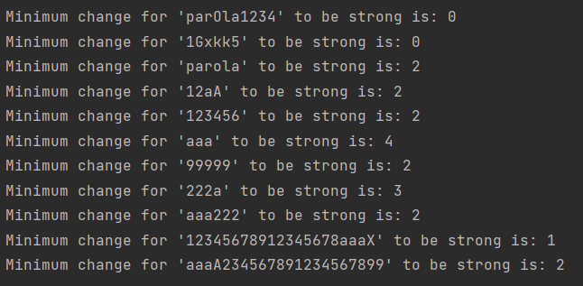

# Strong password checker

A password is considered strong if below conditions are all met:

1. It has at least 6 characters and at most 20 characters.
2. It must contain at least one lowercase letter, at least one uppercase letter, and at least one digit.
3. It must NOT contain three repeating characters in a row ("...aaa..." is weak, but "...aa...a..." is strong, assuming
   other conditions are met).

Write an algorithm that takes a string s as input, and return the MINIMUM change required to make s a strong password.
If s is already strong, return 0. Insertion, deletion or replace of any one character are all considered as one change.

Solution:

I wrote 4 functions that return minimum changes required for insertion, deletion, 
diversity and repeating characters. The sum of these four changes represents the
minimum raw total changes required to make 's' a strong password (if we assume every change satisfies only one condition). 

"asdAs" requires 2 raw changes to be strong (1 for insertion and 1 for diversity)

Three more conditions are added to transform raw changes into final changes:

1.Insertion and diversification can be done with the same change

  "asdAs" -> "asdAs5" - 1 change to be strong instead of 2 raw changes

2.Deletion and change of repeating characters can be done with the same change

3.Diversification and change of repeating characters can be done with the same change

Results:

"parola" requires 2 minimum changes to be strong:

1.Insert one digit / replace a letter with digit    
2.Insert / replace uppercase letter

"99999" requires 2 minimum changes to be strong:

1.Replace middle 9 with lowercase letter  
2.Insert uppercase letter

"aaaA234567891234567899" requires 2 minimum changes to be strong:

1.Delete the second "a"    
2.Delete one more character (not "A")

**passwords are not considered strong if they have more than 20 characters

